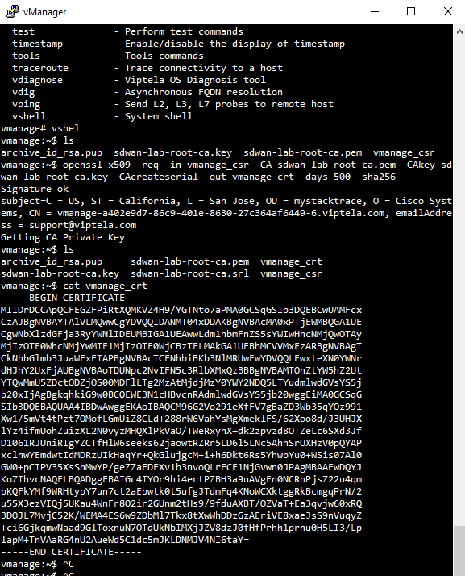

Read me

This repository contains configurations gathered from a variety of videos on YouTube. Kudos to Let's Learn YT (https://www.youtube.com/watch?v=5JqxghWCCiI) for inspiring me to actually log my progress on GitHub. Thank you for providing your initial configurations to the SD-WAN lab. 

Although I have setup the SD-WAB lab on CML, this will be my firt time using Eve-NG for any lab. 

===========================
Note:
When setting up vManage you will need to create an additional drive 100GB using the command line (SSH). 

You will also need to give it pleanty of RAM. I have found out that using 24GB or more is necessary. If you fail to do this, your Cisco SD-WAN GUI for vManaged will not be available. 

I am currently using 32768 MB or 32 GB of RAM.

You can try some commands to check the status of services. 

`request nms all status`
`request nms all start`

Once you have configured vManage, use the vManage IP for VPN 512 on the browser. https://192.168.1.1:8443

To logon to vManage using the console, wait for "System Ready" befor using the default credentials to login. User admin, password admin.

This project is a work in progress. Since this scenario does not have internet access, it causes the ubuntu machine to be really slow when accessing vManage GUI. 

=======================================
When working with Certificate Authority for vManage I encounter the error that my vmanger_crt certificate did not have the serial number of the device. I though I was copying my cert from the SSH Putty session, but the QEMU for Ubuntu does not accept paste from external sources. To get around this issue I SSH from Ubuntu and copy the certificate into vManage GUI successfully. 
